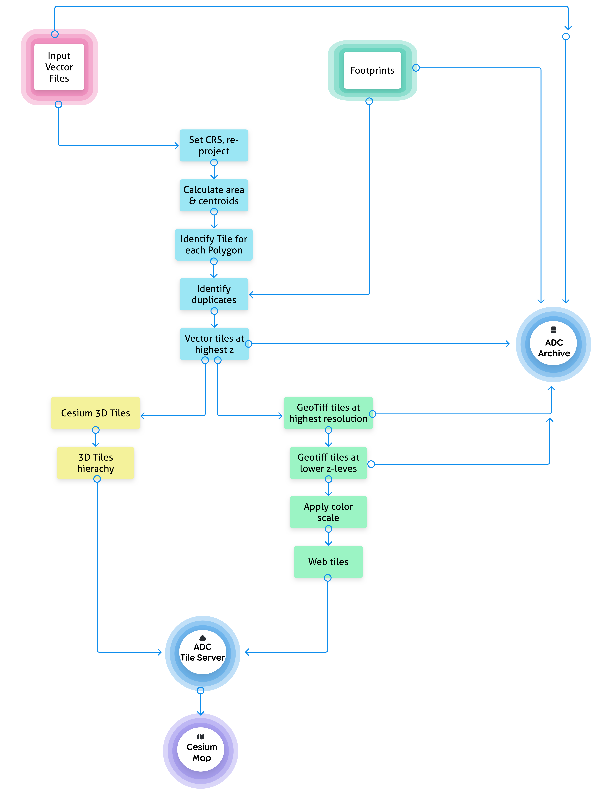

# Viz-workflow: the Permafrost Discovery Gateway geospatial data visualization workflow

- **Authors**: Robyn Thiessen-Bock ; Juliet Cohen ; Matthew B. Jones ; Kastan Day ; Lauren Walker
- **DOI**: [10.18739/A2599Z362](https://ezid.cdlib.org/id/doi:10.18739/A2599Z362)
- **License**: [Apache 2](https://opensource.org/license/apache-2-0/)
- [Package source code on GitHub](https://github.com/PermafrostDiscoveryGateway/viz-workflow)
- [Submit bugs and feature requests](https://github.com/PermafrostDiscoveryGateway/viz-workflow/issues/new)

The Permafrost Discovery Gateway visualization workflow uses [viz-staging](https://github.com/PermafrostDiscoveryGateway/viz-staging), [viz-raster](https://github.com/PermafrostDiscoveryGateway/viz-raster/tree/main), and [viz-3dtiles](https://github.com/PermafrostDiscoveryGateway/viz-3dtiles) in parallel using Ray Core and Ray workflows. An alternative workflow that uses `Docker` and `parsl` for parallelization is currently under development.



## Citation

Cite this software as:

> Robyn Thiessen-Bock, Juliet Cohen, Matthew B. Jones, Kastan Day, Lauren Walker. 2023. Viz-workflow: the Permafrost Discovery Gateway geospatial data visualization workflow (version 0.9.3). Arctic Data Center. doi: 10.18739/A2599Z362

## Usage

To run the visualization workflow with Ray on the National Center for Supercomputing Applications Delta server, see documentation in [`PermafrostDiscoveryGateway/viz-info/09_iwp-workflow`](https://github.com/PermafrostDiscoveryGateway/viz-info/blob/main/09_iwp-workflow.md)

### Port Forward Ray Dashboard

1. Login to a login node on Delta server

```
ssh <👉YOUR_NCSA_USERNAME👈>@login.delta.ncsa.illinois.edu
```
2. Start a Slurm job. `cpus-per-task` must be large (128 maximum on Delta) for Ray to scale well. 

```
# max CPU node request (for single node)
srun --account=<👉YOUR_CPU_ACCOUNT👈> --partition=cpu \
--nodes=1 --tasks=1 --tasks-per-node=1 \
--cpus-per-task=128 --mem=240g \
--time=02:00:00 \
--pty bash
```

3. Then SSH into the compute node you have running Ray. 

```
ssh cn001 (for example)
```
Forward port from compute node to your local personal computer:
```
ssh -L 8265:localhost:8265 <local_username>@<your_locaL_machine> 

# Navigate your web browser to: localhost:8265/
```

## License

```
Copyright [2013] [Regents of the University of California]

Licensed under the Apache License, Version 2.0 (the "License");
you may not use this file except in compliance with the License.
You may obtain a copy of the License at

http://www.apache.org/licenses/LICENSE-2.0

Unless required by applicable law or agreed to in writing, software
distributed under the License is distributed on an "AS IS" BASIS,
WITHOUT WARRANTIES OR CONDITIONS OF ANY KIND, either express or implied.
See the License for the specific language governing permissions and
limitations under the License.
```
